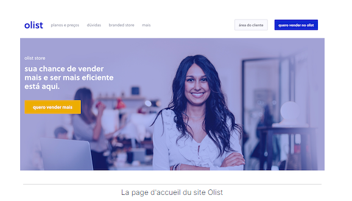
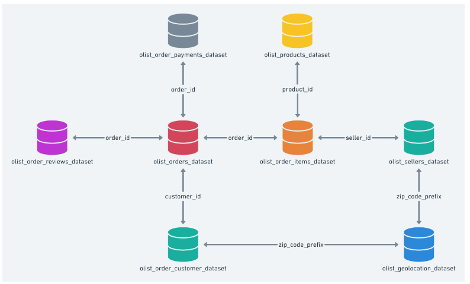

# SEGMENTEZ DES CLIENTS D'UN SITE DE E-COMMERCE

## Quatrième projet de ma formation de Data Scientist

## Contexte

  

Olist souhaite que vous fournissiez à ses équipes d'e-commerce une segmentation des clients qu’elles pourront utiliser au quotidien pour leurs campagnes de communication.

Votre objectif est de comprendre les différents types d’utilisateurs grâce à leur comportement et à leurs données personnelles.

Vous devrez fournir à l’équipe marketing une description actionable de votre segmentation et de sa logique sous-jacente pour une utilisation optimale, ainsi qu’une proposition de contrat de maintenance basée sur une analyse de la stabilité des segments au cours du temps.

## Préambule
Ce projet a été réalisé en langage Python dans des notebooks Jupyter.

## Les données
Pour cette mission, Olist vous fournit une base de données anonymisée comportant des informations sur l’historique de commandes, les produits achetés, les commentaires de satisfaction, et la localisation des clients depuis janvier 2017. Cette dernière est disponible à l'adresse suivante: https://www.kaggle.com/olistbr/brazilian-ecommerce;

Les données sont réparties dans plusieurs tables reliées entre elles par des clés étrangères, suivant le schéma ci-dessous:

  

## Missions
Pour des raisons de confidentialité, nous ne pouvons pas vous fournir beaucoup de données à ce stade. Ensuite, en raison de ressources limitées, nous avons dû vous fournir l’ensemble des données, alors que seule une partie va vous intéresser. Nos dashboards internes nous indiquent en effet que seuls 3 % des clients du fichier de données partagé avec vous ont réalisé plusieurs commandes.

**Mission 1**: Nous sommes confiants sur le fait que les données à disposition suffiront pour réaliser un premier clustering. Cela a déjà été fait par d’autres prestataires par le passé, avec encore moins de données. La segmentation proposée doit être exploitable et facile d’utilisation par notre équipe Marketing. Elle doit au minimum pouvoir différencier les bons et moins bons clients en termes de commandes et de satisfaction. Nous attendons bien sûr une segmentation sur l’ensemble des clients.

**Mission 2**: Une fois le modèle de segmentation choisi, nous souhaiterions  que vous nous fassiez une recommandation de fréquence à laquelle la segmentation doit être mise à jour pour rester pertinente, afin de pouvoir effectuer un devis de contrat de maintenance.

## Contenu du dépôt
1. Le notebook de nettoyage et d'exploration des données: notebook_exploration_1.ipynb.
2. Le notebook des différents essais: notebook_segmentation_2.ipynb.
3. Le notebook pour la recommandation de la fréquence de maintenance: notebook_simulation_3.ipynb.
4. Le support de présentation pour la soutenance: support_presentation_4.pdf.
5. Les librairies nécessaires à la réalisation du projet: requirements.txt.
6. Le schéma de l'agencement des données: schema_donnees.png.
7. L'image de la page d'accueil de la société Olist: page_accueil_site_olist.png.

## Compétences acquises
1. Transformation des variables pertinentes d'un modèle d'apprentissage non supervisé ("feature engineering").
2. Mise en place d'un modèle d'apprentissage non supervisé adapté à la problématique métier.
3. Évaluation des performances d’un modèle d'apprentissage non supervisé.

## Auteur
Coline Plé
